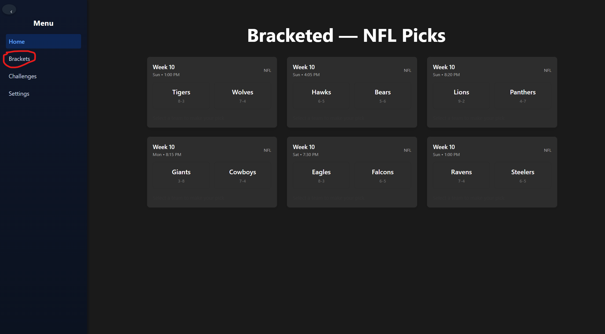
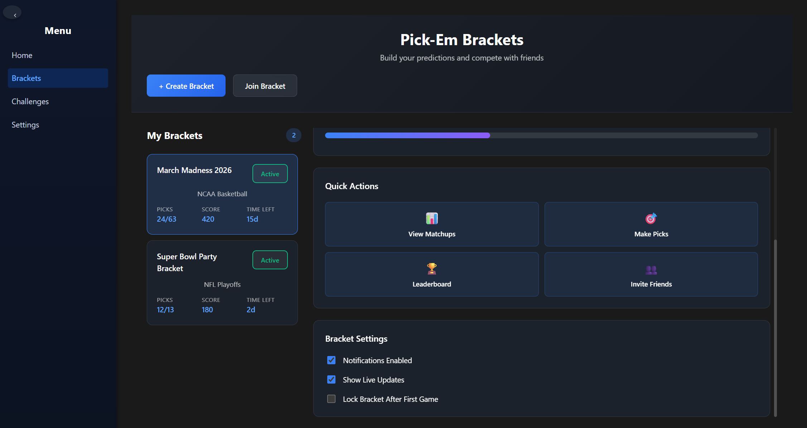
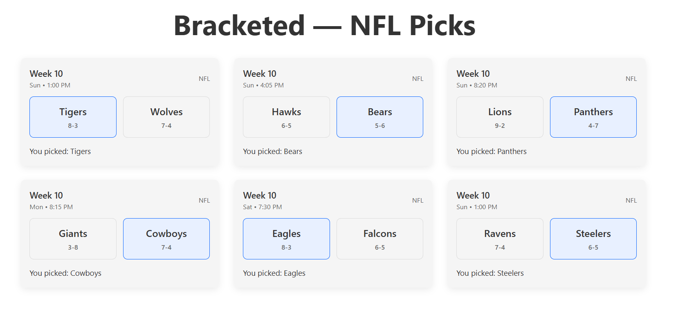

# Bracketed User Documentation
Short Description
---
Bracketed is a web-based platform that lets users create and participate in pick’em-style prediction challenges across multiple sports and esports. Instead of using separate apps or websites for each league, Bracketed brings everything together in one place.

Users can join existing challenges or create their own, make predictions for games or matches, and track results as events progress. Bracketed is designed to be easy to use for casual fans while still supporting a wide range of leagues and competitive formats.

## Table Of Contents
- [Bracketed User Documentation](#bracketed-user-documentation)
  - [Short Description](#short-description)
  - [Table Of Contents](#table-of-contents)
  - [Getting Started](#getting-started)
  - [Joining/Creating Challenges](#joiningcreating-challenges)
    - [Join Challenge](#join-challenge)
    - [Create Challenge](#create-challenge)
  - [Using the Application](#using-the-application)
  - [FAQs](#faqs)
---
## Getting Started
1. Users of the Bracketed Application can go to Bracketed.com
2. Once loaded into the website, users will see a list of games that are going to be played in the coming week
3. To place a prediction, the user will go to the Login/Sign-Up screen where they will login or create an account with just a username and password
4. Once signed in the user can freely pick what team they believe will win
---
## Joining/Creating Challenges
Users can create or join challenges through the "Challenges" tab
### Join Challenge
1. Navigate to the Challenges tab and click on join challenge
2. Users will then be prompted to enter an ID code that is associated with a specific challenge
3. Click join, user may be prompted to enter a password as well
4. You have now joined the challenge and can [make selections](#using-the-application)
### Create Challenge
1. Navigate to the Challenges tab and click on create challenge
2. A list of all games will be shown, use settings to filter by league, team and date
3. Select what games you want to be in the pick'em challenge
4. Click create challenge, a ID code associated with the challenge will be created
5. Use this code to invite other players to join your challenge.
---
## Using the Application
After the user has joined or created a bracket, it's time to play the game!
1. Navigate to the Brackets page  
2. Brackets you've joined/created will be visible to you.  
3. Select the bracket you want to enter.
4. Every game in the bracket will be shown to you.
5. To make your picks, simply click the team you think will win. 
6. Changes can be made to your picks up until the games begin.
7. Check back later to view results!
---
## FAQs
**Do I need an account to use Bracketed?**  
Yes. You must create an account to join or create challenges and submit predictions. This allows Bracketed to save your picks and track your progress.

**What sports and esports are supported?**  
Bracketed is designed to support most major sports and esports leagues. The available leagues may expand over time as new integrations are added. Currently, the sports leagues we support are the MLB, MLS, NBA, and NFL. The only esport we currently support is League of Legends.

**How do I join a challenge?**  
You can join a challenge by selecting it from the available challenges list, using an invite link provided by the challenge creator, or using a code provided by the challenge creator.

**Can I create my own challenge?**  
Yes. Any registered user can create a challenge, choose a league, set rules, and invite other users to participate.

**Can a challenge include games from multiple leagues?**  
Yes. A challenge in bracketed can include a combination of multiple games from any of the supported leagues.

**What happens if I miss a game or forget to submit a prediction?**  
If a prediction is not submitted before the event starts, it will typically be marked as incorrect or skipped, depending on the challenge rules.

**Can I edit my predictions after submitting them?**  
Predictions can usually be edited until the event begins. Once a game or match has started, predictions are locked.

**Is Bracketed free to use?**  
Yes. Bracketed is free to use for creating and participating in challenges.

**Who is Bracketed for?**  
Bracketed is intended for sports and esports fans of all experience levels, from casual viewers to competitive fans who enjoy organized pick’em challenges.
